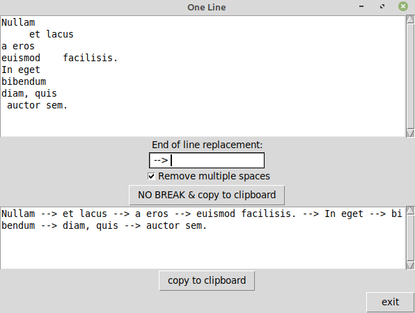

# Small_things

Collection of small Python scripts.

## rename_by_exif.py
Rename images in selected directory by [EXIF](https://exif.readthedocs.io/en/latest/index.html) datetime_origin value. Skip files with missing exif or no JPG extension. Python 3.6+, directory selection dialogue in Tkinter.  
**Known problem:** skipping rename if different images are taken in the exact same second.

## one-line.py
Simple line-break remover. Uses Tkinter as GUI, nothing fancy. You can choose a string to replace line-breaks or decide if you want to remove multiple spaces.

